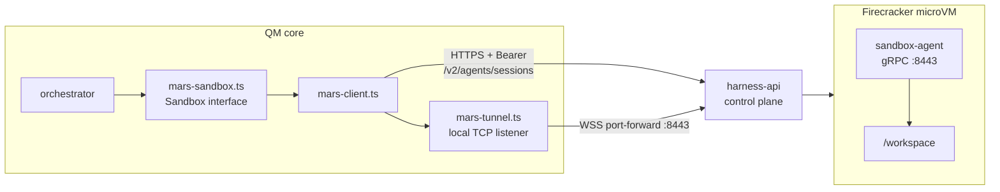
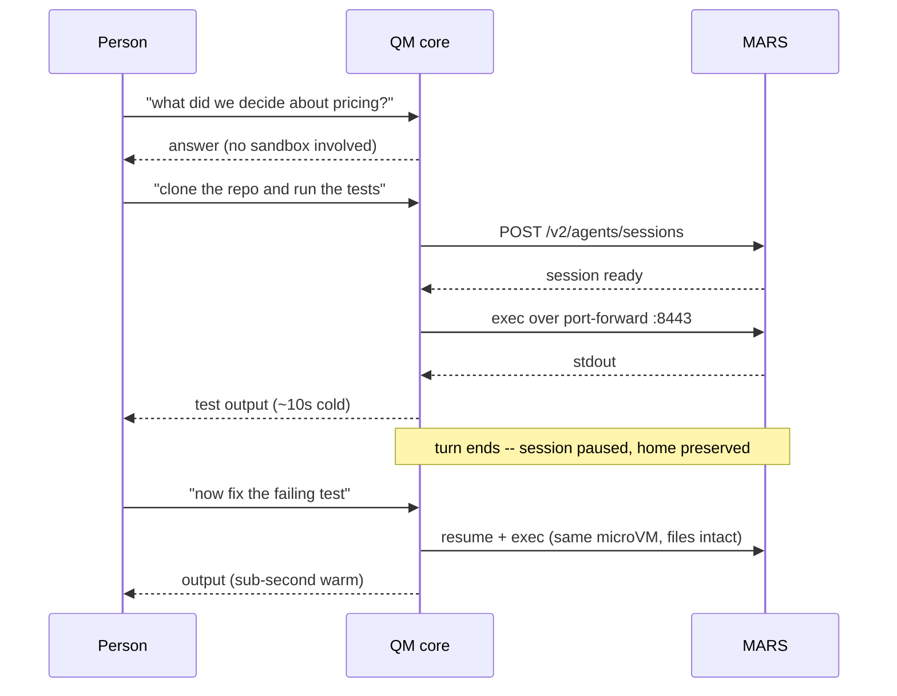

# QM on MARS

This fork adds **MARS** — DigitalOcean's Managed Agent Runtime Stack — as a sandbox backend for
QM, alongside the backends upstream already ships (`local`, `sprites`, `e2b`, `modal`, `aws`,
`porter`, `agent37`, `superserve`, `smolmachines`).

Pick it with one environment variable:

```
SANDBOX_BACKEND=mars
MARS_API_TOKEN=dop_v1_your-digitalocean-iam-token
```

That token is the only credential the backend needs. It is also where team identity comes from —
MARS resolves the team from the token, so there is no separate account or project to configure.

Verified end to end: a real model-driven QM turn calls `execute`, QM provisions a Firecracker
microVM through the MARS control plane, runs the command in the guest, and returns stdout.

## Why this exists

QM's sandboxes back the `execute` tool family: every shell command, file read, and file write the
agent performs happens inside a per-scope "agent computer" that outlives a single turn. Each
person and each room gets its own, with a durable home directory.

MARS already runs hardware-isolated microVMs for DigitalOcean's own agent products. Pointing QM at
it means a self-hosted QM deployment gets Firecracker-grade isolation without standing up a
sandbox fleet, and DigitalOcean customers can run QM on infrastructure they already pay for.

## How it works

Two planes, two credentials' worth of surface area collapsed into one:

- **Control plane** — plain HTTPS against `api.digitalocean.com/v2/agents/sessions`, bearer-authed
  with the IAM token. Create, list, pause, resume, destroy. Sessions are declared with a flat
  YAML manifest (`agents.digitalocean.com/flat.v1`) that says `agent: none`, which asks MARS for a
  **bare sandbox**: a microVM with no managed coding agent in it, which is what QM wants because
  QM already has its own loop. Verified: no agent binary on `PATH`, no agent supervisor process,
  just `sandbox-agent`, `envd`, `otelcol` and s6.
- **Data plane** — a WebSocket port-forward at
  `wss://api.digitalocean.com/v2/agents/sessions/{id}/port-forward/8443`, bridged to a local TCP
  listener, with a gRPC client speaking `SandboxAgentService` over it. That service gives us
  `Exec`, `Upload`, and `Download`, which is exactly the surface QM's `Sandbox` interface needs.

The port-forward carries no request deadline, so a command can run far longer than any HTTP
timeout would allow. There is no mTLS and no certificate material to provision: the guest's
`:8443` listener is plaintext h2c and the tunnel itself is authenticated by the same bearer token
as the REST calls.



Design notes and the decision record live in [`docs/mars.md`](docs/mars.md) and
[`adrs/mars-sandbox-backend.md`](adrs/mars-sandbox-backend.md).

## What a user actually experiences

Nobody using QM picks a sandbox, names one, or waits for one on purpose. MARS is invisible until
the agent needs a shell, and from then on it is mostly invisible again. Here is the whole arc.

**Starting QM creates nothing.** Setting `SANDBOX_BACKEND=mars` only constructs the backend. No
session exists in your DigitalOcean team, and nothing is billed, until a turn needs one. A
deployment can sit idle for a week with zero microVMs.

**Asking a question that needs no shell still creates nothing.** "What did we decide about
pricing?" reads memory and answers. The sandbox is never touched.

**The first command is what provisions the microVM.** When the model decides to call an
execute-family tool, QM creates the session, waits for it to report ready, opens the port-forward
tunnel, and runs the command. The person sees a brief "Creating the sandbox…" status and then
their output. In our measurements that cold path — create, boot, tunnel, exec, reply — came back
in about ten seconds.

**Everything after that reuses the same microVM.** The session name is derived from the scope, not
random, so QM can find it again: it tries the session id it stored, then asks MARS to list
anything matching the name, and only creates when both come up empty. Warm commands skip the
boot entirely and return in well under a second.

**Each person and each room gets its own.** This is QM's isolation model, and MARS enforces it at
the hypervisor. Your DM with the agent, a project channel, and a colleague's DM are three
separate Firecracker VMs that cannot see each other's files. The names make this legible in the
DigitalOcean API — ours looked like `qmdev-personal-naveenkurra-3de9b3`.

**Files and installed tools persist between conversations.** The home directory lives in the
guest's persistent workspace volume, so a repo cloned on Monday is still cloned on Friday, and a
`pip install` survives. When a turn ends QM _pauses_ the session rather than destroying it, which
preserves the whole machine. If `MARS_SNAPSHOT_S3_BUCKET` is set it also snapshots the home
periodically, so even a destroyed session can be rehydrated into a fresh one.

**Idle VMs get reclaimed, and the user never finds out.** MARS reclaims sessions after
`MARS_IDLE_TIMEOUT_SEC`. The next command finds the old session gone, QM treats that as "absent"
rather than an error, provisions a replacement, and hydrates the home from the last snapshot. The
person just sees a slower-than-usual first command.



For sessions that have run tools before, QM starts provisioning in the background at the top of
the turn instead of waiting for the model to ask, which hides most of the cold start. That
pre-warm is fire-and-forget: if it fails, the turn proceeds and the real tool call provisions
normally.

## Hosting it on a Droplet

Nothing about the MARS backend changes QM's own deployment story — follow the upstream
[deployment guide](deployment.md). What matters for MARS specifically:

1. **Node 24.15+** and the repo checked out on the droplet.
2. **`SANDBOX_BACKEND=mars` and `MARS_API_TOKEN`** in the service environment. Keep the token out
   of Git; `.env` and every `*.env` are gitignored and must stay that way.
3. **`PUBLIC_API_URL` must be reachable from inside the microVM.** This is the one requirement
   that catches people out. Sandboxes call back into QM for the agent self-API — crons, sends,
   connector credentials — so this has to be the droplet's public hostname, not `localhost`. A
   laptop running QM locally needs a tunnel for these paths to work; plain `execute` does not.
4. **`MARS_EGRESS_PROXY_URL`** should point at your egress proxy. Without it the session's
   allowlist is not narrowed and sandboxes run with no egress enforcement — QM logs a warning at
   boot, and it is fail-open, not fail-closed.
5. **`MARS_SNAPSHOT_S3_BUCKET`** if you want a destroyed session's home to be recoverable. Pause
   preserves the microVM on its own, but a destroyed session takes the home with it unless a
   portable snapshot exists for a replacement session to hydrate from.

### Configuration

| Variable                     | Required | Meaning                                                          |
| ---------------------------- | -------- | ---------------------------------------------------------------- |
| `MARS_API_TOKEN`             | yes      | DigitalOcean IAM token; also carries team identity               |
| `MARS_API_BASE_URL`          | no       | Defaults to `https://api.digitalocean.com`                       |
| `MARS_TEMPLATE`              | no       | Template override; unset means the bare base `agent: none` picks |
| `MARS_NAME_PREFIX`           | no       | Prefix for session names, useful for telling environments apart  |
| `MARS_SIZE_SLUG`             | no       | microVM size                                                     |
| `MARS_IDLE_TIMEOUT_SEC`      | no       | How long an idle session survives before MARS reclaims it        |
| `MARS_EGRESS_PROXY_URL`      | no       | Egress proxy the session allowlist is narrowed to                |
| `MARS_SNAPSHOT_S3_BUCKET`    | no       | Portable home snapshots                                          |
| `MARS_SNAPSHOT_INTERVAL_SEC` | no       | How often to snapshot the home                                   |
| `SANDBOX_TIMEOUT_SEC`        | no       | Shared default command timeout                                   |

## Verifying a deployment

Two scripts, in increasing order of how much they prove.

**Sandbox backend only** — provisions a real microVM, runs commands, round-trips a file, and
tears down. No model, no QM server.

```sh
MARS_API_TOKEN=dop_v1_... npm run smoke:mars-sandbox
```

**A full QM turn** — drives a real model through `POST /v1/turns` and asserts the reply contains
output that could only have come from the guest. Needs a running QM core and its signing secrets.

```sh
CORE_URL=http://localhost:8081 \
CORE_SIGNING_SECRET=... \
PORTAL_IDENTITY_SECRET=... \
npm run smoke:mars-turn
```

For local development, `dev-instance` understands the backend:

```sh
export MARS_API_TOKEN=dop_v1_...
npm run dev-instance:down
bash scripts/dev-instance.sh up --surface web --sandbox mars --no-slack
```

Two things about that command are easy to get wrong. A live slot reloads from a persisted boot
spec, so changing `--sandbox` on a running slot silently keeps the old backend — take it down
first. And `dev-instance` reads provider secrets from your shell or `~/.config/qm/dev.env`, not
from the worktree `.env`, so `MARS_API_TOKEN` has to be exported.

## Known gaps

- The guest's `/workspace` is the only writable root for file transfer, so QM's home directory
  lives at `/workspace/home` rather than the usual `/home/user`. This also puts the home inside
  the persistent workspace volume, so it survives pause and resume.
- The bare base image carries `bash`, `git`, `node`, and `python3`, but not `rg` or `jq`, which
  agent prompts commonly reach for. A custom `MARS_TEMPLATE` is the fix.
- MARS checkpoints are a public API, but this backend does not use them; it relies on session
  pause plus optional S3 home snapshots instead. The reasoning is in the ADR.
