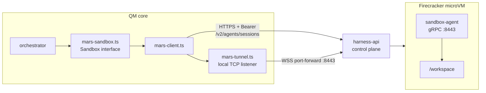

# QM on MARS

This fork adds **MARS** — DigitalOcean's Managed Agent Runtime Stack — as a sandbox backend for
QM, alongside the backends upstream already ships (`local`, `sprites`, `e2b`, `modal`, `aws`,
`porter`, `agent37`, `superserve`, `smolmachines`).

Pick it with one environment variable:

```
SANDBOX_BACKEND=mars
MARS_API_TOKEN=dop_v1_your-digitalocean-iam-token
```

That token is the only credential the backend needs. It is also where team identity comes from —
MARS resolves the team from the token, so there is no separate account or project to configure.

Verified end to end: a real model-driven QM turn calls `execute`, QM provisions a Firecracker
microVM through the MARS control plane, runs the command in the guest, and returns stdout.

## Why this exists

QM's sandboxes back the `execute` tool family: every shell command, file read, and file write the
agent performs happens inside a per-scope "agent computer" that outlives a single turn. Each
person and each room gets its own, with a durable home directory.

MARS already runs hardware-isolated microVMs for DigitalOcean's own agent products. Pointing QM at
it means a self-hosted QM deployment gets Firecracker-grade isolation without standing up a
sandbox fleet, and DigitalOcean customers can run QM on infrastructure they already pay for.

## How it works

Two planes, two credentials' worth of surface area collapsed into one:

- **Control plane** — plain HTTPS against `api.digitalocean.com/v2/agents/sessions`, bearer-authed
  with the IAM token. Create, list, pause, resume, destroy. Sessions are declared with a flat
  YAML manifest (`agents.digitalocean.com/flat.v1`).
- **Data plane** — a WebSocket port-forward at
  `wss://api.digitalocean.com/v2/agents/sessions/{id}/port-forward/8443`, bridged to a local TCP
  listener, with a gRPC client speaking `SandboxAgentService` over it. That service gives us
  `Exec`, `Upload`, and `Download`, which is exactly the surface QM's `Sandbox` interface needs.

The port-forward carries no request deadline, so a command can run far longer than any HTTP
timeout would allow. There is no mTLS and no certificate material to provision: the guest's
`:8443` listener is plaintext h2c and the tunnel itself is authenticated by the same bearer token
as the REST calls.



Design notes and the decision record live in [`docs/mars.md`](docs/mars.md) and
[`adrs/mars-sandbox-backend.md`](adrs/mars-sandbox-backend.md).

## Hosting it on a Droplet

Nothing about the MARS backend changes QM's own deployment story — follow the upstream
[deployment guide](deployment.md). What matters for MARS specifically:

1. **Node 24.15+** and the repo checked out on the droplet.
2. **`SANDBOX_BACKEND=mars` and `MARS_API_TOKEN`** in the service environment. Keep the token out
   of Git; `.env` and every `*.env` are gitignored and must stay that way.
3. **`PUBLIC_API_URL` must be reachable from inside the microVM.** This is the one requirement
   that catches people out. Sandboxes call back into QM for the agent self-API — crons, sends,
   connector credentials — so this has to be the droplet's public hostname, not `localhost`. A
   laptop running QM locally needs a tunnel for these paths to work; plain `execute` does not.
4. **`MARS_EGRESS_PROXY_URL`** should point at your egress proxy. Without it the session's
   allowlist is not narrowed and sandboxes run with no egress enforcement — QM logs a warning at
   boot, and it is fail-open, not fail-closed.
5. **`MARS_SNAPSHOT_S3_BUCKET`** if you want a destroyed session's home to be recoverable. Pause
   preserves the microVM on its own, but a destroyed session takes the home with it unless a
   portable snapshot exists for a replacement session to hydrate from.

### Configuration

| Variable                     | Required | Meaning                                                         |
| ---------------------------- | -------- | --------------------------------------------------------------- |
| `MARS_API_TOKEN`             | yes      | DigitalOcean IAM token; also carries team identity              |
| `MARS_API_BASE_URL`          | no       | Defaults to `https://api.digitalocean.com`                      |
| `MARS_TEMPLATE`              | no       | Guest image. Unset means MARS derives it from the agent kind    |
| `MARS_NAME_PREFIX`           | no       | Prefix for session names, useful for telling environments apart |
| `MARS_SIZE_SLUG`             | no       | microVM size                                                    |
| `MARS_IDLE_TIMEOUT_SEC`      | no       | How long an idle session survives before MARS reclaims it       |
| `MARS_EGRESS_PROXY_URL`      | no       | Egress proxy the session allowlist is narrowed to               |
| `MARS_SNAPSHOT_S3_BUCKET`    | no       | Portable home snapshots                                         |
| `MARS_SNAPSHOT_INTERVAL_SEC` | no       | How often to snapshot the home                                  |
| `SANDBOX_TIMEOUT_SEC`        | no       | Shared default command timeout                                  |

## Verifying a deployment

Two scripts, in increasing order of how much they prove.

**Sandbox backend only** — provisions a real microVM, runs commands, round-trips a file, and
tears down. No model, no QM server.

```sh
MARS_API_TOKEN=dop_v1_... npm run smoke:mars-sandbox
```

**A full QM turn** — drives a real model through `POST /v1/turns` and asserts the reply contains
output that could only have come from the guest. Needs a running QM core and its signing secrets.

```sh
CORE_URL=http://localhost:8081 \
CORE_SIGNING_SECRET=... \
PORTAL_IDENTITY_SECRET=... \
npm run smoke:mars-turn
```

For local development, `dev-instance` understands the backend:

```sh
export MARS_API_TOKEN=dop_v1_...
npm run dev-instance:down
bash scripts/dev-instance.sh up --surface web --sandbox mars --no-slack
```

Two things about that command are easy to get wrong. A live slot reloads from a persisted boot
spec, so changing `--sandbox` on a running slot silently keeps the old backend — take it down
first. And `dev-instance` reads provider secrets from your shell or `~/.config/qm/dev.env`, not
from the worktree `.env`, so `MARS_API_TOKEN` has to be exported.

## Known gaps

- The guest's `/workspace` is the only writable root for file transfer, so QM's home directory
  lives at `/workspace/home` rather than the usual `/home/user`. This also puts the home inside
  the persistent workspace volume, so it survives pause and resume.
- The stock guest image carries `bash`, `git`, `node`, and `python3`, but not `rg` or `jq`, which
  agent prompts commonly reach for. A custom `MARS_TEMPLATE` is the fix.
- MARS checkpoints are a public API, but this backend does not use them; it relies on session
  pause plus optional S3 home snapshots instead. The reasoning is in the ADR.
