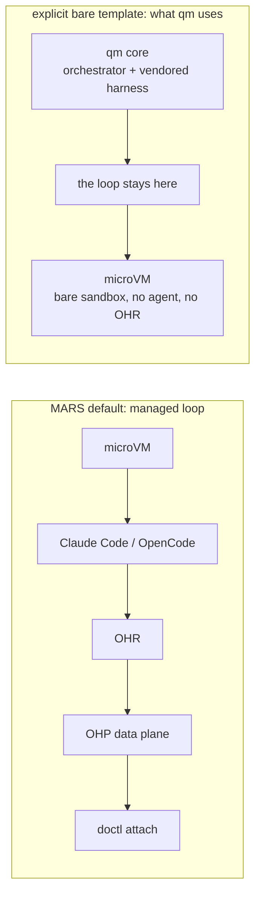
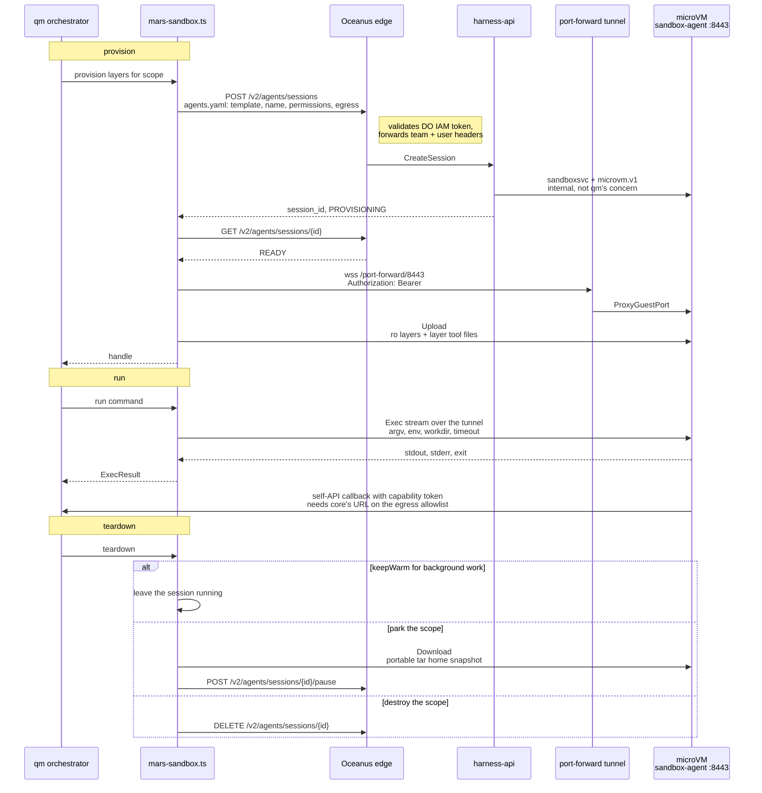

# MARS as an agent-computer backend

Naveen, from the MARS team at DigitalOcean. MARS (Managed Agent Runtime Stack) hosts coding agents in DO-managed Firecracker microVMs. We looked at what it would take for qm to run on it and the answer is the same one Agent37 arrived at: the part of qm that wants hosting is the agent computer, so this is another sandbox backend, next to E2B, Modal, Sprites, smolmachines, Porter, AWS, Superserve and Agent37.

The reason this is worth doing at all is that MARS is a managed-loop product by default — it boots Claude Code or OpenCode _inside_ the microVM, next to a process called OHR that translates events back to our control plane. That is not what qm wants, because qm already has a loop. But our platform has a second mode for exactly this case. A session that names a sandbox template explicitly is decoupled from the agent-kind gate entirely: the template names the environment, and the agent kind only selects which adapter, if any, runs inside it. Name a template with no coding agent and you get a bare sandbox — no managed agent, no OHR, no OHP. We wrote that mode for OpenAI, whose Agents API wanted DO microVMs under someone else's brain; our design doc calls it "the architectural inversion." qm lands in the same seat. Nothing about qm's orchestrator, harness router or tool surface has to change.

The lifecycle lines up closely enough with the E2B backend that this is modeled on that pair of files rather than on a new shape. One MARS session per qm scope, created on first use, named with the scope name so an operator can find it with `doctl agents list`, paused at teardown, deleted when qm destroys the scope. Our pause keeps the microVM's disk and memory, which is what `provider_managed` persistence already means in your profile.

Everything qm needs is on one host with one credential. Session lifecycle is harness-api, which external callers reach as REST through Oceanus, the DO edge proxy that validates a DO IAM token and forwards the authenticated team and user as headers — the same path doctl takes. So that half is plain HTTP+JSON with a token, and the team identity comes from the token rather than from configuration.

Exec and file transfer take a different route to the same host. Every microVM runs `sandbox-agent`, a gRPC server on guest port 8443 that our own control plane dials for exec, transfer and readiness. qm reaches it the way `doctl agents port-forward` does: a bearer-authenticated WebSocket to `/v2/agents/sessions/{id}/port-forward/8443`, which harness-api bridges to the guest port and qm exposes as a local TCP listener for a gRPC client. 8443 is explicitly allowed by our tunnel port policy, the guest listener is plaintext h2c with no client certificate, and we register the port-forward route without a request deadline on purpose. So a long command is bounded by qm's own `SANDBOX_TIMEOUT_SEC` and nothing else.

Worth saying why qm does not use `POST /sandbox/exec`, since we built it and it looks like the obvious fit. It terminates in harness-api and buffers the result, so it clamps to four minutes and one mebibyte per stream and carries no per-command environment. Those bounds are right for `doctl agents exec` and wrong for an agent turn.

Here is a turn end to end. Lifecycle goes through the edge as REST; exec and files go through the tunnel to the guest.

What the PR adds

- `SANDBOX_BACKEND=mars`, with `MARS_API_TOKEN` required — a DO IAM token, which is also where the team identity comes from, and the only credential the backend needs. Optional knobs: `MARS_API_BASE_URL`, `MARS_TEMPLATE`, `MARS_NAME_PREFIX`, `MARS_SIZE_SLUG`, `MARS_IDLE_TIMEOUT_SEC`, `MARS_EGRESS_PROXY_URL`, `MARS_SNAPSHOT_INTERVAL_SEC`, `MARS_SNAPSHOT_S3_BUCKET`, and the shared `SANDBOX_TIMEOUT_SEC`.
- `src/sandbox/mars-tunnel.ts`, the port-forward client: one WebSocket per TCP connection, bytes piped both ways with one chunk in flight per direction so a slow consumer cannot make core buffer the stream. The local listener is unreferenced, so an abandoned tunnel can never hold core's event loop open.
- `src/sandbox/mars-client.ts`, holding both transports behind one interface the way `e2b-client.ts` wraps the E2B SDK: REST for `/v2/agents/sessions{,/{id},/{id}/pause,/{id}/resume}`, and `SandboxAgentService` stubs for `Exec`, `Upload` and `Download` over the tunnel. Our 404s, terminal statuses and gRPC `UNAVAILABLE` translate to the same two error classes the E2B client uses — one for a sandbox that was already gone before a command started, which the backend reconnects and retries, and one for a sandbox lost mid-command, which is reported rather than retried because the command may have partially run. The session body is an agents.yaml manifest in its flat form, which is the shape we are standardising on.
- `src/sandbox/mars-sandbox-agent.proto`, a vendored copy of our guest proto with the internal annotations stripped, loaded at runtime through `@grpc/proto-loader`. No build step and no generated code in the tree.
- `src/sandbox/mars-sandbox.ts`. Provision creates or resumes the session and waits for it to become usable. Run is `Exec` over the tunnel. Files are `Upload` and `Download` rather than base64 through exec, since we have real transfer RPCs. Process sessions, read-only layers, layer tool install, home snapshots and blob staging come from the shared exec helpers unchanged.
- Scope recovery without local state. Session names are team-unique among non-terminal sessions and `ListSessions` takes a `?name=` filter, so the backend can re-adopt a running sandbox after losing its durable record, the way the E2B backend re-adopts by sandbox metadata. `sandboxScopeName` already produces names that fit our 64-character, not-UUID-shaped rule.
- Profile: `writablePersistence: "provider_managed"`, `processSessions: true`, `parksOnTeardown: true`, and `egressEnforcement: "domain"`. That last one is real rather than aspirational — a MARS sandbox gets NAT egress with a per-session host allowlist, and the manifest's `permissions.network` block narrows within it.
- A `permissions` block on the session that sets `defaultAction: allow` and allows `bash`. Our `ExecInSandbox` is HITL-gated by default, which means every command would wait on a human decision through our approval router. qm runs its own approval gates at its own tool boundary and fires many commands per turn, so two gating systems in series would just deadlock. qm's posture stays authoritative; ours gets out of the way. This is deliberate and we would rather state it here than have it discovered later.

What it does not do

- No provider checkpoints, though not for the reason you might expect. We do expose session checkpoints publicly — `POST /v2/agents/sessions/{id}/checkpoints` is synchronous and returns a terminal checkpoint — along with list, rollback and fork. This backend simply does not use them yet, so it gets native pause and falls back to your portable tar home snapshot for recovery, under `MARS_SNAPSHOT_INTERVAL_SEC` and `MARS_SNAPSHOT_S3_BUCKET`. Moving to native checkpoints, the way the Sprites backend reports `provider_snapshot`, is a clean follow-up. The one thing to check first is that our checkpoints bind machine state to the event-log cursor and refuse during an active turn, both of which are managed-loop concepts that need verifying against a session that has no turns.
- No idle reaping from qm's side. Our control plane owns the idle timeout, set per session with `MARS_IDLE_TIMEOUT_SEC` and bounded by tenant policy. Paused sessions still count against team quota, which is worth knowing before pointing a large deployment at us.
- No image plumbing. `MARS_TEMPLATE` names a template already provisioned for the team; an unprovisioned name fails session create. Building a qm-flavoured template, so the layer tool install step finds its files already present, is a follow-up and not in this PR.
- No new CLI target. `qm init` still deploys core to Docker, Fly or AWS. This only changes where the computers live.

Two things we need from you, or at least need to agree on

- Reachability runs both ways. qm needs to reach `api.digitalocean.com` and nothing else, which is the easy direction. But qm's sandboxes also call _back_ into core's self-API with their capability tokens, the way the E2B backend needs a public `PUBLIC_API_URL`. That means core's public URL has to be on the session's egress allowlist. For a qm deployment inside DO this is fine; for one on Fly or AWS it means our allowlist has to carry an arbitrary external host, which we should confirm is acceptable to your operators and ours.
- A bare template has to exist for your team. `MARS_TEMPLATE` names a template already provisioned for the team, and naming one is what keeps the managed agent out of the microVM. Our `base` image carries `sandbox-agent`, `envd`, Python, Node and `gh` and nothing agent-shaped, which is the right starting point, but we should agree on which template qm deployments actually get and who keeps it current. An unprovisioned name fails session create, so this is a hard prerequisite rather than a tuning knob.

Tests run against an in-process harness-api, a real gRPC `sandbox-agent` and a WebSocket tunnel between them, so the transport is exercised end to end and CI needs no DO account and no credentials. We would rather this live upstream than in a fork, and we will keep it green as the sandbox contract moves.
