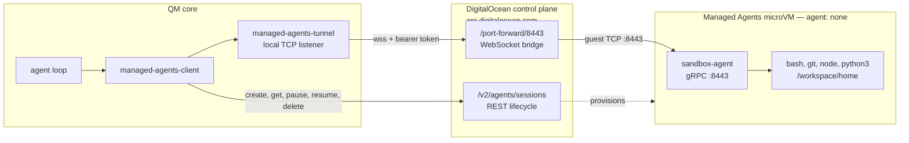

# Managed Agents agent sandboxes

`SANDBOX_BACKEND=do-managed-agents` runs each QM scope in a DigitalOcean Managed Agents microVM — a
Firecracker guest with a persistent home, hypervisor-level isolation between
scopes, and provider-managed pause and resume.

Managed Agents is normally a managed-agent product: you hand it a manifest naming a
coding agent and it runs that agent's loop inside the guest for you. QM does
not want that. The manifest says `agent: none`, which Managed Agents admits as a bare
sandbox — its own base image, no managed agent, no in-guest event-translation
runtime, no model credential. QM keeps its own agent loop in core and drives
the guest as a computer, exactly as it does for every other backend. See
[the design record](../adrs/managed-agents-sandbox-backend.md) for why.

## What it provides

A microVM per scope, not per turn. Each person and each room gets its own
guest, isolated at the hypervisor rather than by container namespaces. Teardown
pauses rather than destroys, so files, installed packages, and clones survive
between conversations and the next turn resumes the same machine.

Persistence is the provider's, not ours. Managed Agents preserves the guest's disk across
pause and resume on its own, so the backend reports `provider_managed`
persistence and does not need to tar the home up after every turn. The S3
snapshot path exists only to survive losing the session entirely.

One credential, one endpoint. A DigitalOcean IAM token authenticates both
halves of the integration, and there are no client certificates, internal
hostnames, or VPC prerequisites to arrange.

## Architecture

Two planes, one token. Lifecycle is ordinary REST. Commands and files travel a
WebSocket the control plane bridges into the guest.



The tunnel is the part worth understanding. Every Managed Agents microVM runs
`sandbox-agent`, a gRPC server on guest port 8443 that Managed Agents's own control plane
uses for exec and file transfer. QM reaches it the same way
`doctl agents port-forward` does: it opens a WebSocket to
`/v2/agents/sessions/{id}/port-forward/8443`, which the control plane bridges to
the guest port, and exposes that as a local TCP listener a gRPC client dials.
There is no direct network path from core to the microVM; the control plane
proxies bytes.

QM deliberately does not use the REST `POST /v2/agents/sessions/{id}/sandbox/exec`.
That endpoint buffers output in the control plane, so it clamps commands to four
minutes and one mebibyte per stream and carries no per-command environment. The
port-forward route has no request deadline, so a command is bounded only by
`SANDBOX_TIMEOUT_SEC`.

## Operations

### Create

Nothing is provisioned when core boots, and a turn that needs no shell never
touches Managed Agents. The first execute-family tool call provisions, which takes about
ten seconds end to end: post the manifest, poll until the session reports ready,
open the tunnel, run the command.

Every later turn for the same scope reconnects in well under a second, because
the session name is derived from the scope. The backend tries, in order, the
session id it has stored, then whatever Managed Agents lists under that name, and only
creates when both come up empty. A paused session is resumed rather than
replaced.

With `EAGER_PROVISION` at its default, a scope that has used tools before starts
provisioning at the top of every turn instead of waiting for the model to ask,
which hides the cold start. Set `EAGER_PROVISION=0` for the strictly on-demand
path.

### Exec

Commands run as `/bin/bash -c` over a bidirectional gRPC stream, carrying
per-command environment, working directory, and a timeout. Output streams back
as it is produced, capped at 16 MiB per stream — write larger results to files
and read them instead.

Background process sessions, `startProcess` and friends, are built on the same
stream, so long-running servers behave as they do on other backends.

### Upload and download

File transfer uses the guest agent's `Upload` and `Download` RPCs over the same
tunnel, chunked at 256 KiB. A download of a missing file reads as `null` rather
than raising.

`sandbox-agent` confines transfer to the guest workspace, so a scope's home
lives at `/workspace/home` rather than the usual `/home/user`. That also places
it inside the volume Managed Agents preserves, so the home survives pause and resume on
its own.

### Pause and resume

Both are automatic, and neither is a verb a user or the model can call.

A scope pauses when its turn tears down. If a home snapshot is due the backend
takes it first, then calls `POST /v2/agents/sessions/{id}/pause` and closes the
tunnel. A pause that fails is not silent: the scope is recorded as
`pause_failed` with the provider's error, which surfaces in the computer status
and in error reporting. Two cases skip the pause — an internal `keepWarm`
teardown, used when core knows another turn is imminent, and a teardown that
destroys instead.

A scope resumes the next time anything needs the guest. Provisioning polls the
session, and on finding it paused issues `POST /resume` once and keeps polling
until it reports usable, up to five minutes. So the resume is a side effect of
the next command rather than a step anybody triggers; the only visible evidence
is that the first command of a conversation takes a little longer.

There is no manual pause or resume from QM. The `sandbox` tool's verbs are
`list`, `create`, `set_default`, `status`, and `retire` — and for this backend
`restart` is not offered either, because `do-managed-agents` implements no `restartComputer`.
What you can do is **observe** and **destroy**: `status` reports
`lifecycleState: "paused"` along with the snapshot state and any
`pause_failed` error, and `retire` deletes outright. If you want a scope to stop
costing anything, retire it rather than looking for a pause button.

### Delete

Teardown at the end of a turn **pauses**. Actual deletion happens in four places
and no others:

- An explicit retire, through the agent's `sandbox` tool or the admin API.
- Scratch sandboxes, which are always killed rather than paused.
- A failed home hydration, which kills the session rather than risk overwriting
  a good snapshot with a half-populated home.
- Swarm workers, which are retired when the swarm finishes.

## Gotchas

**Deleting a conversation does not delete the microVM.** Nothing in QM ties
scope deletion to sandbox deletion, and the `do-managed-agents` backend implements no deep
idle reaper, so core's sweeper never reclaims one. A paused microVM stays
paused, indefinitely, until somebody retires it or Managed Agents's own idle policy
reclaims it. Budget for that: set `DO_AGENTS_IDLE_TIMEOUT_SEC` so the provider has a
backstop, and retire scopes you are finished with.

**`PUBLIC_API_URL` has to be reachable from inside the guest.** Reachability
runs both ways: core calls the control plane, and microVMs call back into core's
self-API for the connector SDK and file callbacks. A deployment behind
`localhost` serves shell commands fine but cannot complete a cron, a send, or a
credential fetch.

**The bare base is smaller than agents assume.** It carries `bash`, `git`,
`curl`, `tar`, `node`, `python3`, `make`, and `gcc`. It does not carry `jq`,
`rg`, or `unzip`, all of which prompts reach for by name. The profile reports
them as not installed so the model does not try; naming your own template in
`DO_AGENTS_TEMPLATE` is how you add them.

**Set `DO_AGENTS_SNAPSHOT_S3_BUCKET`.** It is how a scope's home survives losing its
session. Managed Agents exposes session checkpoints, but QM does not use them yet, so
without the bucket a destroyed or reclaimed session takes the home with it. See
[sandbox recovery](sandbox-preservation.md) for capture and hydration rules.

**Sessions are created with `bash` pre-allowed.** Managed Agents has its own
human-in-the-loop gate on command execution, enforced in the guest. Leaving it
on would hold every command behind an approval nobody is watching, so the
manifest allows `bash` outright and QM's own approval gates stay authoritative.

**Name your deployments apart.** Session names are derived from the scope and
`DO_AGENTS_NAME_PREFIX`, which is also how an operator finds a scope's microVM in the
Managed Agents console without consulting core's database. Two deployments sharing a prefix
on one Managed Agents team will adopt each other's sandboxes. Managed Agents caps names at 64
characters and rejects UUID-shaped ones.

## Configure

```sh
SANDBOX_BACKEND=do-managed-agents
DO_AGENTS_API_TOKEN=dop_v1_your-digitalocean-iam-token
DO_AGENTS_NAME_PREFIX=my-qm
DO_AGENTS_SNAPSHOT_S3_BUCKET=my-qm-sandbox-homes
```

Store the token as a core service secret. Production requires `DATABASE_URL`
for session records and provisioning locks across instances.

| Variable                          | Default                        | Purpose                                                           |
| --------------------------------- | ------------------------------ | ----------------------------------------------------------------- |
| `DO_AGENTS_API_TOKEN`             | Required                       | DigitalOcean IAM token, held by core.                             |
| `DO_AGENTS_API_BASE_URL`          | `https://api.digitalocean.com` | Control-plane endpoint override; any path prefix is preserved.    |
| `DO_AGENTS_TEMPLATE`              | Provider bare base             | Template override; unset means the bare base `agent: none` picks. |
| `DO_AGENTS_NAME_PREFIX`           | `qm`                           | Namespace for scope discovery.                                    |
| `DO_AGENTS_SIZE_SLUG`             | Provider default               | microVM size.                                                     |
| `DO_AGENTS_IDLE_TIMEOUT_SEC`      | Provider default               | Provider-side idle reclaim backstop.                              |
| `DO_AGENTS_EGRESS_PROXY_URL`      | Unset                          | Proxy host to allow; everything else is denied.                   |
| `DO_AGENTS_SNAPSHOT_S3_BUCKET`    | Unset                          | Portable home tars. Without it the backend reports no recovery.   |
| `DO_AGENTS_SNAPSHOT_INTERVAL_SEC` | `300`                          | Snapshot throttle.                                                |
| `SANDBOX_TIMEOUT_SEC`             | `600`                          | Default command deadline in seconds.                              |

Without `DO_AGENTS_EGRESS_PROXY_URL`, sandboxes have unrestricted egress and the
profile reports no enforcement. With it, sessions are created denying all
outbound traffic except the proxy host, so `HTTPS_PROXY` cannot be bypassed from
inside the microVM.

## Local development

```sh
export DO_AGENTS_API_TOKEN=dop_v1_...
bash scripts/dev-instance.sh up --surface web --sandbox do-managed-agents
```

Two things differ from the other backends. `dev-instance` reads provider secrets
from your shell or `~/.config/qm/dev.env`, not from the worktree `.env`, so the
token has to be exported. And a live slot reloads from its persisted boot spec,
so changing `--sandbox` on a running slot keeps the old backend — take it down
first.

## Tests

Backend tests run without an account. They stand up an in-process control plane,
a real gRPC `sandbox-agent`, and a WebSocket tunnel between them, so the
transport is exercised end to end:

```sh
node --test test/managed-agents-client.test.ts test/managed-agents-sandbox.test.ts
```

Two smokes exercise a real account. The first provisions a microVM and runs
commands, files, and a pause cycle through the `Sandbox` interface; set
`DO_AGENTS_SMOKE_LONG=1` to add a 250-second command that outlives the REST exec
clamp. The second drives a live model turn against a running core and asserts
the reply carries output that could only have come from the guest.

```sh
DO_AGENTS_API_TOKEN=dop_v1_... npm run smoke:managed-agents-sandbox
CORE_SIGNING_SECRET=... PORTAL_IDENTITY_SECRET=... npm run smoke:managed-agents-turn
```
